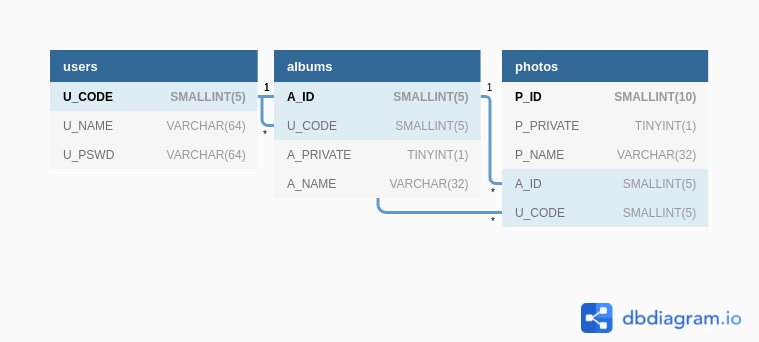

# Image hosting web app
This web application was created as part of the shopify backend challenge.
It is hosted at https://images.warrenfisher.net

## Features
- Can upload a file, either my drag and drop into the file zone or
    by clicking and using file selector
    - Can view files at the 'image gallery' tab
- Uploading multiple files creates an album
    - Can view albums at the 'albums' tab
- Users can optionally create an account
    - User passwords are hashed and then sent to the backend for storage in a database
    - API returns a user authentication token, which the frontend will include with subsequent requests
- Files or albums can be made private (if you have an account)
    so only you can see them
- You

## Development

- An uploads/albums folder must exist in the root
- Go to api/ and run `python app.py`
- Go to frontend/ and run `npm run start`

## Backend
MySQL database diagram

## Frontend

## Dependencies 
### API / backend
- Python
- MySQL
- SQLAlchemy
- few packages in requirements.txt
### Frontend
- React
- react-router-dom 
- shopify-polaris